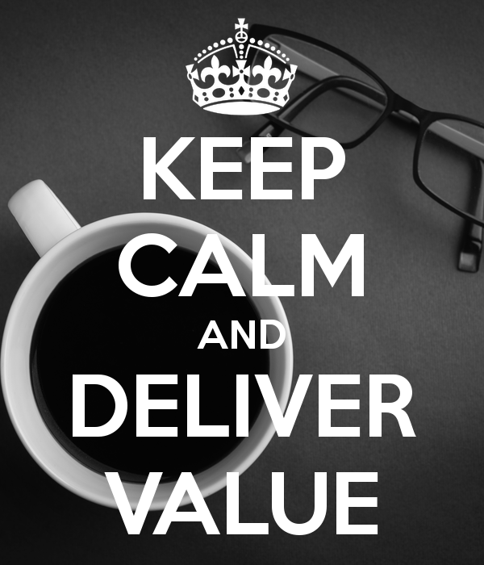

    

Scrum has a very well defined set of roles. If you’re not one of the team members that is directly developing the product (e.g. developer, tester, designer, etc.) you’re either a Scrum Master (SM) or a Product Owner (PO). And it’s about the latter that I would like to talk about today since I feel there are a lot of misconceptions around their role.

Let’s start by clarifying the definition of the PO role and for that I’ll quickly summarize [Jeff Sutherland](https://en.wikipedia.org/wiki/Jeff_Sutherland)’s four essential characteristics of a PO that he describes in his book “[Scrum — The Art of Doing Twice the Work in Half the Time](https://www.goodreads.com/book/show/19288230-scrum)”

1. **Market expert** - The PO must have a close relation to the customer and the market, understand its needs and translate that into real value.
   
2. **Decision maker** — Being able to define the product vision and decide how to get there is essential for the PO role. However it should be clear that a PO should also let the team to take their own decisions.
   
3. **Available to the team** — A PO must be in permanent contact and dialog with the team to ensure they understand the vision.
   
4. **Responsible for delivered value** — Measurability is essential to understand if the product being built is indeed giving the expected value. It’s therefore paramount to have a metric that allows for measurement and it’s the PO responsibility to measure and maximize the value being delivered based on that.
  
I always like to read what the original authors have to say about any topics I’m trying to learn. It’s the best way to ensure that things don't get “lost in translation”. In this particular case I think Jeff was very straight forward about it’s vision of the role of a PO in the Scrum process.

Words such as authority, boss or even manager are nowhere to be found on those definitions. There is the “decision” word but it also says that despite having decision powers a PO must not be the only one “calling the shots” and there are decisions that fall onto the team.
Leadership and authority are very different concepts with no direct connection between then. So it should be at least awkward to everyone that joins a so called Scrum team and realizes that somewhere along the way someone decided to correlate those.

In the last years I’ve seen this happening in many projects, inside and outside consulting, in which the role of the PO is fulfilled by someone who has no direct evolvement with the final customer or by someone which is chosen only by its position on the company.

This happens because people tend to look at Scrum roles and imagine them scattered along a hierarchal tree and if so then PO should be at the highest level, SM right below and the rest of the team on the lower level. A typical director, manager, team member scenario. 

Which is ridiculous since those kind of hierarchies don’t have any place on the Scrum framework neither have I ever seen the authors proposing a hierarchical structure of any kind. That’s also why people tend to think that project managers in a traditional sense should be Scrum Masters which is untrue, but more on that some other time.

Product owners must lead the team to ensure they develop a product that meets the customer needs and delivers real value. Being capable to avoid waste and clarify on requirements are essential skills to the PO.

To accomplish that the PO must use the direct connection they have with the final customer and construct the backlog, define the priorities and which of the stories are still relevant at any given time and which must be dropped or delayed if changes to the scope are needed, for example when a new story is identified and must go into the top of the backlog since it’s the one that will deliver the most value to the customer.

The risk of not having a PO with the above skillset is very clear and the consequences are easily spotted:

- Not understanding the customer needs will result in a poor quality backlog in which the requirements are not clear enough for the team’s implementation to give true value to the customer;
  
- Lack of prioritization makes the team clueless of the direction to go, what they should implement next and what is the customer expectations of the product. Typically this is the case where everything is urgent and must be done ASAP and we all know where that leads to;
- Similarly, if the PO is not available to the team when they need, the process will stop, things will get delayed and no one will gain from that, quite the contrary;
  
- If a PO tries to impose its role like its a hierarchical position and take that as a mean for authoritarianism will not only defeat the purpose of giving decision power to the teams (and all the benefits that comes with it) but will also result in a poorly implemented product since it’s very likely the PO lacks the expertise to have a well opiniated decision on the best way to implement the product.

While reading those bullet points you may have though to yourself “this means that someone on the top of the ladder in a company is rarely a good fit for being a PO of that company’s products” and you’re absolutely right. CEOs, high executive, directors, etc. already have a lot to deal with and probably won’t be able to satisfy the level of commitment that is needed to fulfil the PO role. That’s why they have to delegate that in someone else.

The PO can be someone from marketing that is constantly looking at the market and has a clear idea what the customers want because there are a lot of studies and research that gives the marketing team a lot of data to work with. It can also be someone from a factory that has a clear notion of the production line and what a new software or machine would need to have to make the workers more productive, probably because it has a close contact with them and listens to their complaints and suggestions.

Implementing Scrum is all about maximizing productivity and increasing the delivered value of a product. Regardless of who is picked to be a PO it’s role must be about guaranteeing that and to help the team follow the best path to reach that goal.