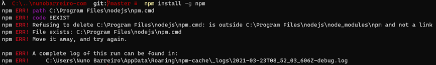
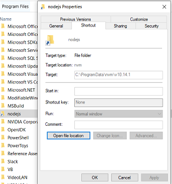

I really enjoy using NVM for Windows. For those who doesn't know this project, it really simplifies the management of multiple NodeJS versions on a Windows machine. For more information please refer to the [GitHub project repository](https://github.com/coreybutler/nvm-windows).

Unfortunately, when using NVM for Windows, I always face issues such as this one when trying to update NPM:

First, lets try to understand how NVM is working. When you use NVM to install a version of NodeJS, for example 10.14.1, and start using it, a `nodejs` link will be created in the `Program Files` folder pointing to the real folder where the NodeJS version is installed. You can easily find out what is the correct path if you check the properties of that link.

If you open that location, you'll notice that `npm` and `npx` files are there and that inside the `node_modules` folder there is the `npm` package which is the current version in use. When you're trying to execute the `npm install -g npm` command, you're pretty much trying to update something that is in use and the update process seems to give errors because we are using a linked folder, and not the real path.

To fix this and be able to update NPM, I've created a simple PowerShell script that you can download and execute. 

It will rename both `npm` and `npx` files in the NodeJS installation root and also the `npm` folder inside `node_modules`. Then it will run the update process using the `npm-cli.js` inside the `npm` package which will reinstall `npm` but now with the latest version. Finally the script deletes the old files so to maintain everything cleaned up.

Hope this is helpful for everyone that uses NVM fow Windows. If you're not already doing so, give it a try. 😉

Happy coding and see you on a next post.
